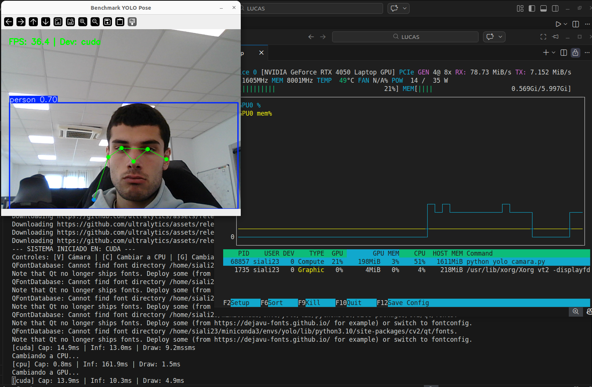

# Uso de Yolo y Benchmarking

## Configuracion del Entorno

Recomendado el uso de miniConda para gestionar el entorno
  ## Crear el entorno
  - conda create -n vision python=3.10 -y
  - conda activate vision

  ## Instalar librerías necesarias
  pip install ultralytics

  [Para más información][https://github.com/ultralytics/ultralytics] 

## Estructura del Proyecto

  - src/yolo_camara.py: Script principal con la lógica de procesamiento
  - images/: Directorio donde se guardan las imágenes en su estado inicial
  - images_detecciones/: Directorio donde se guardan las imágenes ya procesadas
  - requirements.txt: Lista de librerías Python necesarias

## Flow de la Aplicación

 1. Inicialización de recursos: El script carga en la VRAM el modelo y realiza la
      selección dinámica entre GPU y CPU
 2. Input: El sistema pregunta al usuario mediante interrupciones la captura de fotogramas
      de la webcam o el procesamiento de las imágenes de images/
 3. Pipe-line de procesamiento: Se aplica el redimensionado, se calculan las probabilidades
      y se filtra para evitar detecciones falsas.

 4. Output: Dibujo de las "Bounding Boxes", puntos de articulaciones y lineas del esqueleto humano.
      Metricas en tiempo real(FPS, Latencia) y guardado en images_detecciones/
 5. Análisis de resultados: Muestra de las top 5 detecciones y Logs de Hardware

## Controles del Programa

Al ejecutar python src/main.py se abrira una ventana en vivo con los siguientes controles:

  - Tecla v: Comienza a capturar el vídeo
  - Tecla q: Cierra la aplicacion y libera la camara
  - Tecla c: Comienza a ejecutar la captura de video por CPU
  - Tecla g: Comienza a ejecutar la captura de video por CPU

